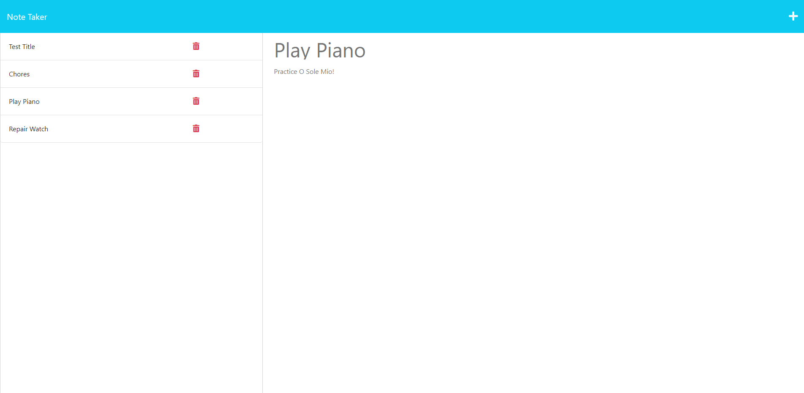

# Note Taker

## Description

## Table of Contents
* [Usage](#usage)
* [Contact-Me](#contact)
* [Contributors](#contributors)
* [Testing](#testing)

* [License](#license)

## Usage
This application is called Note Taker that can be used to write and save notes. 
[Deployed Application Link](https://easy-note-taker-application-39c0c4503c26.herokuapp.com/)

The following image shows the command-line application's appearance and functionality:

## Mock-Up

## Contact
* Name - Ricardo Scuotto
* Email - ucfscuotto@gmail.com
* Github - [Ricky-Sama](https://github.com/Ricky-Sama/)
## Contributors
N/A
## Testing
